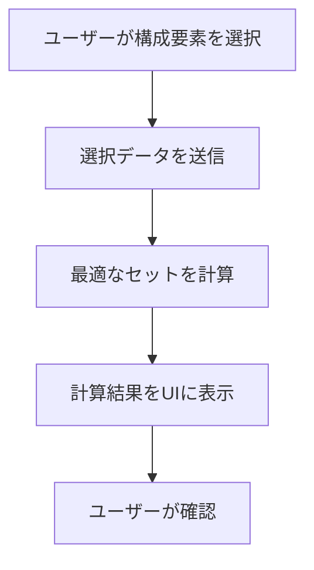

# マクドナルド注文最適化アプリ計画

## 要件
- ユーザーが食べたい構成要素を選択する。
  - 例: マックフライポテト + チキンマックナゲット10個 + ハンバーガー
- 最適なセットの注文を計算し、表示する。
  - 例: ポテナゲ大 + ハンバーガー

## 技術スタック
- **フロントエンド**: SvelteKit
- **ロジック**: TypeScript
- **テスト**: Vitest

## 実装計画
1. **メニュー情報を管理するデータ構造を作成**
   - メニュー情報をJSON形式で管理。
2. **ユーザーが構成要素を選択するUIを作成**
   - SvelteKitを使用してインタラクティブなUIを構築。
3. **最適なセットを計算するアルゴリズムを実装**
   - 入力された構成要素を基に、最適なセットを計算。
4. **計算結果をUIに表示**
   - 計算結果をユーザーに見やすく表示。
5. **テストを作成してロジックを検証**
   - Vitestを使用してアルゴリズムとUIのテストを実施。

## アルゴリズム概要
- 入力された構成要素を基に、`products` 配列を検索。
- 各セットの構成要素と価格を比較し、最適な組み合わせを計算。
- 必要に応じて単品メニューも考慮。

## ファイル構成
- `src/routes/+page.svelte`: UIの実装。
- `src/lib/menu.ts`: メニュー情報と計算ロジック。
- `src/demo.spec.ts`: テストコード。

## ワークフロー

## 次のステップ
- この計画に基づいて実装を開始。
- 必要に応じて計画を調整。
